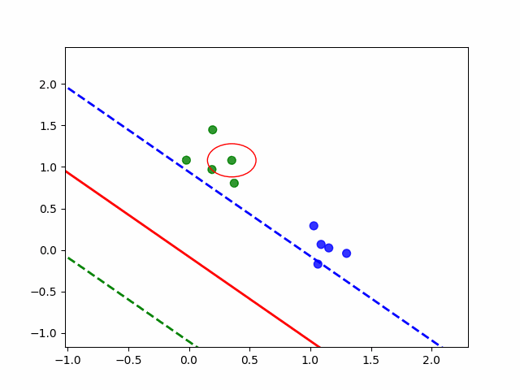
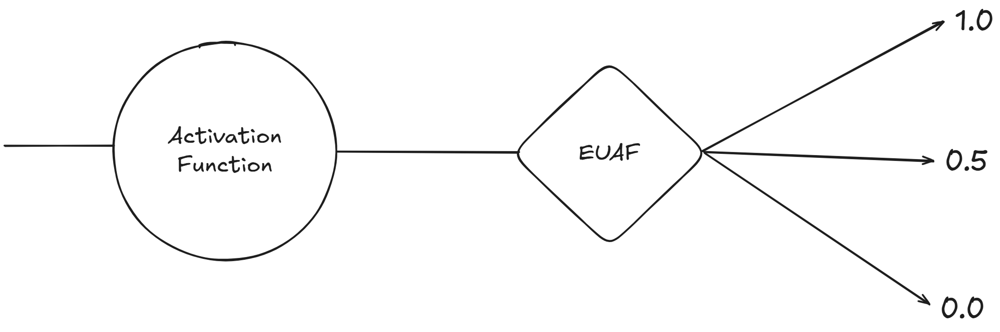
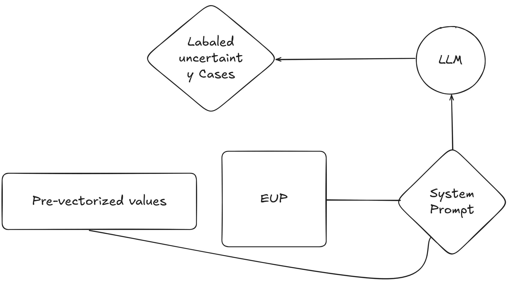
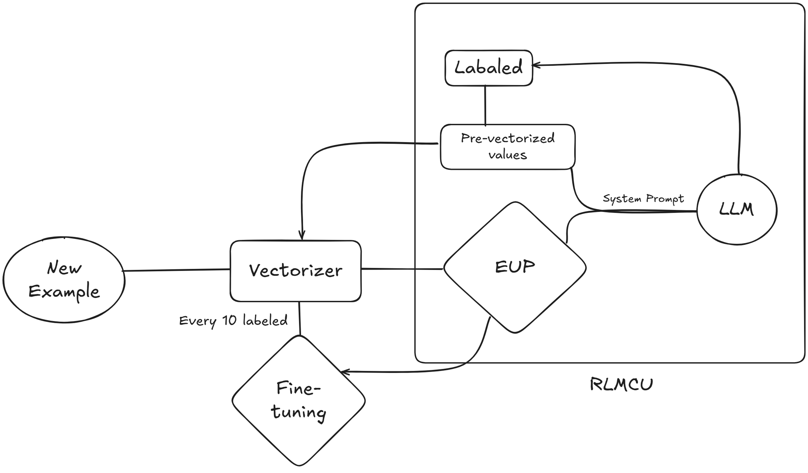
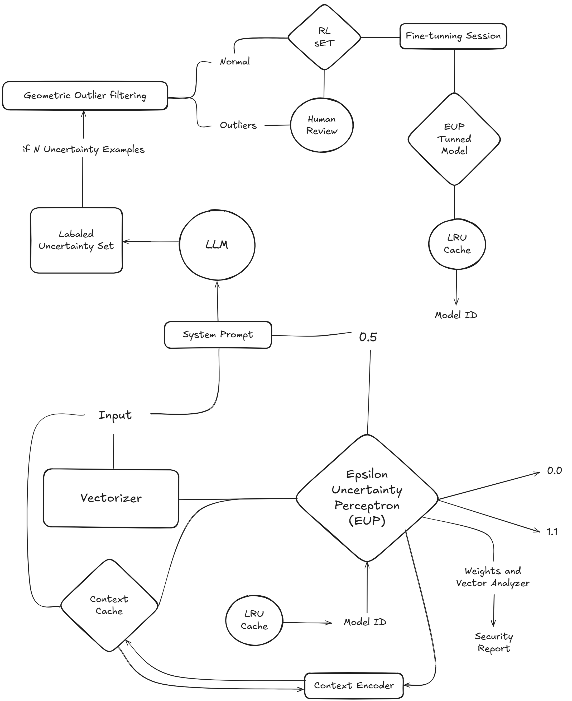

# Epsilon Recurrent Feedback for Linear Models (ERF-LM)

**Writed by** Dylan Sutton Chavez

*Artificial Intelligence Engineer and Systems Engineer*

**Date:** October 23, 2025

**© Dylan Sutton Chavez. All rights reserved.**

*This document is issued on the date of October 23, 2025 to whom it may concern, containing an explanation of the system ERF-LM.*

---

## Abstract

Deep learning models (e.g., Transformers, RNNs, CNNs) are increasingly deep, with training and fine-tuning cycles predominantly driven by reinforcement learning from human feedback (RLHF). As of October 23, 2025, there exists no established methodology for efficient knowledge transfer from a deep neural network to a linear model. This work proposes a framework in which a linear model quantifies its own predictive uncertainty (ε) and autonomously identifies features that require escalation to a high-capacity model. These selected features are subsequently labeled, enabling the linear model to be trained on the resulting enriched dataset, effectively bridging the gap between linear and deep representations.

---

## 1. Introduction and Background

Models such as the simple perceptron (Rosenblatt, 1958), linear regression (Legendre, 1805), and logistic regression (Cox, 1958) share the property of performing prediction and binary classification tasks across an arbitrary number of input features (Cover, 1958). These models operate by mapping a high-dimensional feature space to a single binary output (0, 1), providing foundational frameworks for linear decision boundaries and interpretable predictive modeling.

Linear models typically operate under the “general linear combination formula” — (Legendre, 1805). This formula can be interpreted as the dot product of the weights of each feature and their corresponding input, plus a bias term:

$$
y = f\left( \sum_{i=1}^{n} w_i x_i + b \right)
$$

The output of this formula is passed through a function, with each model having its own activation: simple perceptron (Step function. Heaviside, 1899), logistic regression (Sigmoid function. Verhulst, 1838). Some models, such as linear regression, do not have an activation function, as the output is a continuous value.

This method is computationally efficient, O(1), but it introduces a bias when attempting to make linear predictions in high-dimensional spaces, since the uncertainty in each prediction (y) increases with the number of dimensions (n). This, in turn, increases the probability of error as more features are added: y(n), and the current output functions of linear models cannot detect uncertainty (ε).

 The ERF-LM framework incorporates an external uncertainty parameter (ε) to identify out-of-distribution or atypical examples for which the linear model has not been trained. Such instances are escalated to a high-capacity model, e.g., a large language model (LLM), which provides binary labels (0, 1) for active supervision. 

The labeled data is then used to update the linear model, creating a closed-loop knowledge distillation cycle in which the linear model progressively approximates the LLM’s decision boundaries. This approach achieves an effective model e≈e(LLM) while retaining extreme computational efficiency, as updates in the linear model remain O(1).

## 2. System Architecture

To implement the uncertainty mechanism (ε), the simple perceptron linear model was selected. This model converts the product of the general linear combination formula into a binary output (0, 1) using the step function:

$$
h(x)=1 (x ≥ 0), 0 (x<0)
$$

The uncertainty (ϵ) functions as a constant that you define before each prediction (creating a grey area). Thus, the output will be positive (1) if the continuous value (x) is greater than the uncertainty (ϵ); in the event that the output (x) is less than the negative uncertainty (−ϵ), it will be a negative prediction (0). Finally, if neither of those two conditions are false, epsilon will have been fulfilled, meaning the prediction falls into the area of uncertainty (ϵ).

$$
h(x)=1 (x>ε), 0 (x<-ε), 0.5 (-ε ≤ x ≤ ε)
$$

The implementation of this uncertainty (ϵ) solves the problem of hallucinations in Artificial Intelligence models (the model itself knows when it doesn't know something). By detecting this and requesting help, the model receives high-confidence labels that generate high-confidence data. This prevents the model from being contaminated by attempting to re-train on examples it already knows.

When the model outputs uncertainty (ϵ), a request is sent to an LLM to provide the correct binary label (0, 1) for the unrecognized example. This actively labeled example is then saved to a database for use in the next fine-tuning epochs.

For each learning epoch, the model uses the Perceptron learning rule (Rosenblatt, 1958) to adjust its weights. This adjustment is calculated by multiplying the learning rate (η)) by the difference between the true label (y) and the perceptron's output (ŷ), based on the binary step function's output (0 or 1).

$$
w_i = w_i + \eta (y - \hat{y}) x_i
$$

$$
b = b + \eta (y - \hat{y})
$$

The complete architecture of ERF-LM functions such that during EUP model inference, if an uncertainty case (ϵ) is detected, a call is triggered to the LLM according to the RLMCU protocol. A fine-tuning cycle is then utilized after every defined number of uncertainty (ϵ) examples, allowing the EUP model to match the efficiency of the LLM model at an O(1) computational cost.

## 3. Why Linear Models

A wide range of tasks are inherently complex, yet ultimately exhibit linearity. Engineers typically avoid using such simple linear models, because over the decades since the advent of the first linear models, increasingly complex and deep architectures based on logic (conjunction, disjunction, etc.) have been developed. As a result, simpler linear models were largely set aside, despite their extremely low computational cost (O(1)). ERF-LM enables a simple linear model to achieve inference costs that are virtually negligible, while maintaining the efficiency of a model that would otherwise incur several dollars per inference.

## 4. ERF-LM Implementation and Experimental Validation

One of the most complex and persistent linear problems in the field of computer science is detecting whether an entity is initiating an attack (1) or generating normal traffic (0). For the validation of the ERF-LM framework, we will focus on the new OWASP Top 10: 2025 framework for web application vulnerabilities, specifically by implementing a Web Application Firewall (WAF).

# LLM-Assisted Geometric Active Perceptron (L-GAP): High-Dimensional Active Learning Module for OWASP Threat Detection

The L-GAP architecture is based on ERF-LM, adding several subsystems that maintain the majority of the computational cost at O(1). This is achieved by integrating various sub-components and addressing several distinct problems.

1. **Model Input Vector:** One of the most important steps will be the definition of our vector; this is achieved by taking a security log and applying vectorization. There are several components in a security record that allow us to increase the dimensions of our vector, achieving linear separability (e.g., payload, http, metrics, metadata,...).

2. **Context per User:** The most sophisticated security attacks (where all current solutions fail) require the identification of complex patterns. To address this, we formulate a context per user (c), which is recalculated during each inference and dynamically adjusts the weights (w). This dynamic adjustment enables the model to effectively identify complex attacks “w(c)”.

3. **Isotropic Transformations Before the ERF-LM Fine-tuning Cycle:** The EUP model's activation function filters cases of uncertainty (ϵ), which drastically increases the prediction efficiency in a sensitive domain like cybersecurity. To incorporate an additional layer of data validation within the ERF-LM architecture, we adopt the principle: “Outlier detection employs a linear transformation... referred to as rounding” — (Dunagan, 2002). This technique leverages geometry to detect anomalous labels and patterns from the LLM, ensuring that only the most extreme geometric outliers are escalated to a human review team.

4. **Payload Vectorization with O(1) Character N-gram Hashing:** To guarantee the Perceptron's high-speed inference for payloads (e.g., SQL injections: ' OR '1'='1'), the vectorization process must operate in near O(1) time, independent of vocabulary size. This is achieved using Character N-gram Hashing. This technique bypasses the need for an external dictionary and converts the variable-length payload into a fixed-size, high-dimensional vector using a determined generation hash (salt).

5. **Weights and Vector Analyzer:** The architecture of the EUP model is so simple that we can generate a security report with each analysis by comparing the model’s weights with the vector. This allows the security team to understand every decision made by the model and the reasoning behind it.

